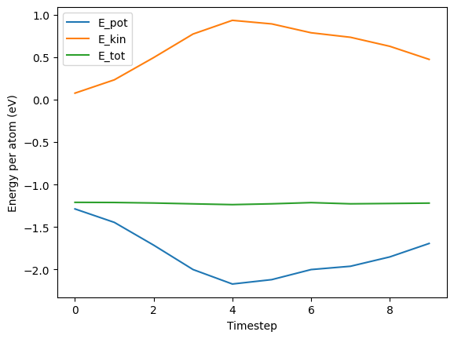

Simulation of a single H_2O molecule in a unit cell vacuum, using
- PBE functional,
- plane-wave basis method
with the [GPAW ab-initio MD](https://wiki.fysik.dtu.dk/gpaw/documentation/documentation.html) library.

